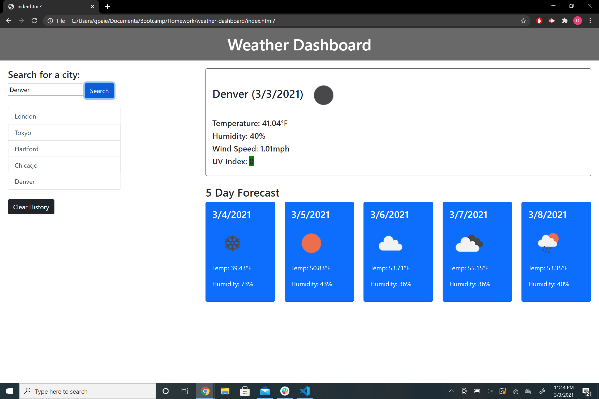

# weather-dashboard

[See the deployed application here](https://gmpaier.github.io/weather-dashboard/)

## Objective: 
Create a weather dashboard for potential travellers so that they can view weather conditions in multiple cities.

## Requirements:
```
Ability to search for a city using the OpenWeather API
Returns city name, date, an icon reflecting current weather conditions, temperature, humidity, wind speed, and the UV-index.
Also displays 5-day forecast for chosen city with less info: date, weather icon, temperature, and humidity.
The UV index is color coded based on conditions: green is good, yellow is middling, and red is dangerous.
Prior searches are displayed in a list.
Search history is saved to local storage.
Website is functional, easy to use, and deployed on GitHub Pages
```
As a bonus, I tried at every step to minimize the amount of API calls, and instead load saved weather data when possible.



## Content:

index.html - html of application

assets - 

    script.js - javascript of application
    
    style.css - auxilary styling not handled by Bootstrap